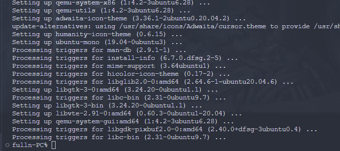

## 内核编译

1. 安装编译相关工具、库等

2. 安装Clang/LLVM

3. 下载代码
git clone git@github.com:cicvedu/cicv-r4l-fulln.git 

4. 配置BusyBox

5. 安装qemu

6. 安装rust 

7. 配置Linux文件夹

7.1  将此目录中的rustc重置为特定版本

7.2  添加rust-src源代码

