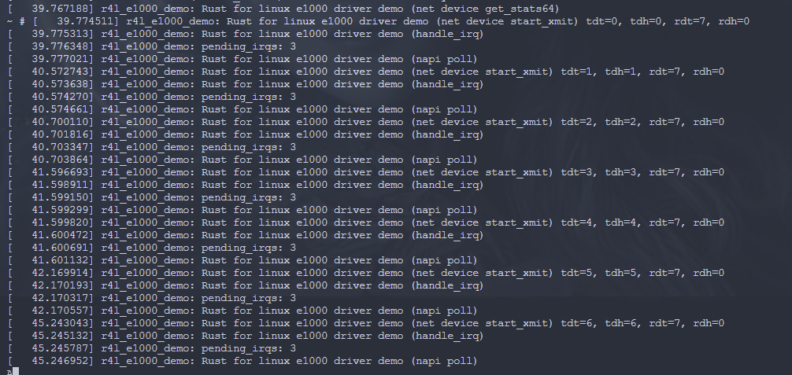
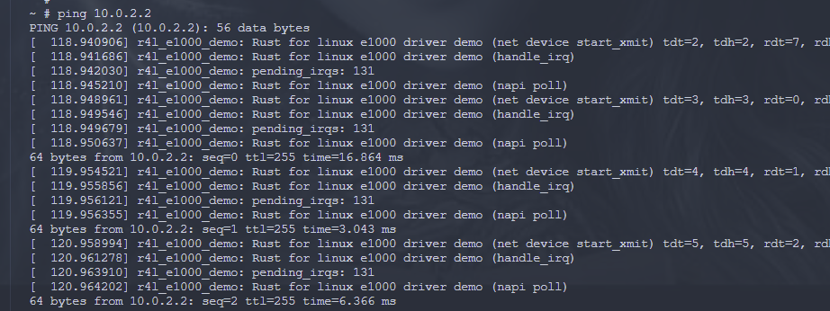

1. 编译成内核模块，是在哪个文件中以哪条语句定义的？

kbuild的make

```
obj-m := r4l_e1000_demo.o
```

2. 该模块位于独立的文件夹内，却能编译成Linux内核模块，这叫做out-of-tree module，请分析它是如何与内核代码产生联系的？

设备树，注册为一个linux上的一个设备， 然后该设备通过总线和内核系统进行代码交互，具体调用内核代码是将内核代码通过一个代理的rust类， 把所有需要调用的内核api申明出来， 然后在上层封装成对应的模块和实体如plafrom，devices等类，具体是在binds 这个包下的generate类里面申明的。

3. 实操





